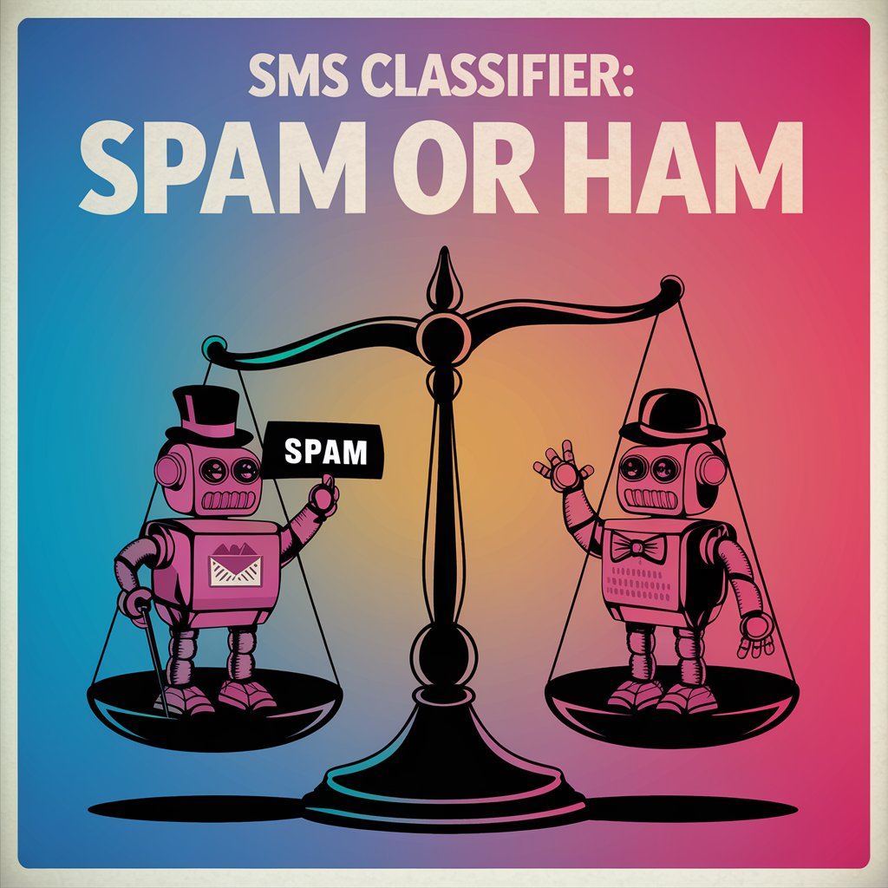

# SMS Classifier: Spam or Ham



## Introduction
This project aims to build a machine learning model that classifies SMS messages as either "spam" or "ham" (non-spam). Leveraging the Word2Vec model for word embeddings and a Random Forest classifier, the project addresses the challenge of identifying unsolicited messages, thereby enhancing user experience and reducing unwanted communication.

## Installation
To set up the project, follow these steps:

1. **Clone the repository**:
   ```bash
   git clone https://github.com/yourusername/sms-classifier.git
   cd sms-classifier
   ```

2. **Install the required libraries**:
   ```bash
   pip install -r requirements.txt
   ```

3. **Ensure you have Jupyter Notebook installed**:
   ```bash
   pip install notebook
   ```

## Usage
To use the project, run the Jupyter Notebook file:

1. Launch Jupyter Notebook:
   ```bash
   jupyter notebook
   ```

2. Open the `sms_classifier.ipynb` notebook.

3. Follow the instructions in the notebook to load the data, preprocess it, train the model, and evaluate its performance.

## Features
- **Data Preprocessing**: Cleans the SMS messages by removing URLs, HTML tags, punctuation, and stop words.
- **Text Vectorization**: Utilizes Word2Vec for converting text data into numerical form.
- **Model Training**: Implements a Random Forest classifier for training on the processed data.
- **Evaluation Metrics**: Provides accuracy scores and classification reports for model evaluation.
- **Visualization**: Includes plots to visualize the distribution of spam and ham messages.

## Data
The project uses the SMS Spam Collection Dataset from [Kaggle](https://www.kaggle.com/datasets/uciml/sms-spam-collection-dataset). The dataset consists of SMS messages labeled as spam or ham.

- **Format**: CSV
- **Preprocessing**: Messages are cleaned and converted to lower case, URLs and HTML tags are removed, and one-hot encoding is applied to labels.

## Methodology
The approach consists of the following steps:

1. **Data Loading**: Load the dataset into a Pandas DataFrame.
2. **Text Preprocessing**: Apply various preprocessing techniques to clean the data.
3. **Vectorization**: Use the Word2Vec model to convert text messages into vector representations.
4. **Model Building**: Split the data into training and testing sets, and train a Random Forest classifier.
5. **Model Evaluation**: Evaluate the model's performance using accuracy and classification reports.


## Conclusion
The SMS classifier effectively distinguishes between spam and ham messages using machine learning techniques. The use of Word2Vec for text vectorization significantly improved the model's ability to capture semantic meanings in the messages.


